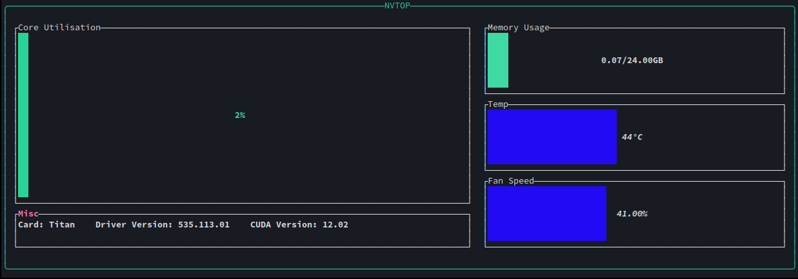

# NVTOP 
<center>


An NVIDIA SMI'esk GPU Monitoring tool for your terminal.

</center>

`nvtop` is a command-line utility that provides a replacement for some of the output from `nvidia-smi` (System Management Interface).
It offers real-time monitoring and visualization of GPU information: Core Clock, Temps, Fanspeed and Memory Usage.

# Usage:
```
# Monitor the GPU and system with a 1-second update interval
nvtop --delay 1000
```

# Why?
because _this:
```shell
+---------------------------------------------------------------------------------------+
| NVIDIA-SMI 535.113.01             Driver Version: 535.113.01   CUDA Version: 12.2     |
|-----------------------------------------+----------------------+----------------------+
| GPU  Name                 Persistence-M | Bus-Id        Disp.A | Volatile Uncorr. ECC |
| Fan  Temp   Perf          Pwr:Usage/Cap |         Memory-Usage | GPU-Util  Compute M. |
|                                         |                      |               MIG M. |
|=========================================+======================+======================|
|   0  NVIDIA TITAN RTX               Off | 00000000:0A:00.0  On |                  N/A |
| 41%   44C    P0              67W / 280W |   1367MiB / 24576MiB |      2%      Default |
|                                         |                      |                  N/A |
+-----------------------------------------+----------------------+----------------------+

+---------------------------------------------------------------------------------------+
| Processes:                                                                            |
|  GPU   GI   CI        PID   Type   Process name                            GPU Memory |
|        ID   ID                                                             Usage      |
|=======================================================================================|
|    0   N/A  N/A      1008      G   /usr/lib/Xorg                               439MiB |
+---------------------------------------------------------------------------------------+
```

is **boring**, and this:


is **fun!**

